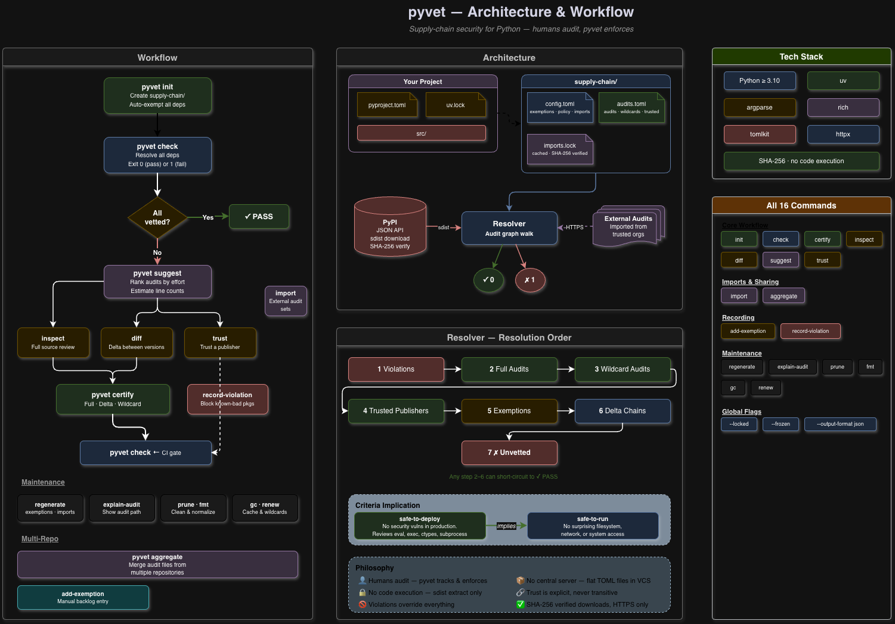

# pyvet

Supply-chain security for Python (PyPI) packages.

**pyvet** ensures that every third-party dependency in your Python project has been audited by a trusted entity before it ships. It is a Python equivalent of Mozilla's [cargo-vet](https://mozilla.github.io/cargo-vet/) for Rust crates.



## Why

Anyone can publish a package to PyPI. Most projects pull in dozens of transitive dependencies without reviewing them. A single compromised package can exfiltrate secrets, install backdoors, or mine cryptocurrency on your CI runners.

**pyvet does not scan code or detect vulnerabilities automatically.** It is an audit *tracking* and *enforcement* tool. The philosophy is simple: humans are the auditors. pyvet records who reviewed what, under which criteria, and ensures that nothing ships without that review having happened.

The primary reason developers don't audit dependencies is that it's too much work. pyvet reduces that effort to a manageable level through three mechanisms:

- **Sharing** — Public packages are used by many projects. Organizations can share their audit findings so the same package isn't reviewed by every team independently.
- **Delta audits** — Different versions of the same package are usually very similar. Reviewing just the diff between a previously-audited version and the new one is far less work than auditing from scratch.
- **Deferred audits** — Full coverage isn't always practical on day one. Pre-existing dependencies are exempted automatically, and the backlog is ratcheted down over time.

## Key Features

- **Zero-effort bootstrap** — `pyvet init` adds all existing deps as exemptions. You start protected immediately and audit the backlog over time.
- **Full & delta audits** — Audit an entire package, or just the diff between two versions.
- **Trusted publishers** — Trust all versions of a package published by a specific PyPI user within a date range.
- **Shared audits** — Import audit sets from other organizations to avoid duplicate work.
- **CI gate** — `pyvet check` exits with code 1 on failure, making it a drop-in CI blocker.
- **No central server** — Everything is plain TOML files in your repository's `supply-chain/` directory.

## Installation

Requires Python ≥ 3.10.

```
uv add pyvet
```

Or install globally:

```
uv tool install pyvet
```

## Quick Start

### 1. Initialize

```
pyvet init
```

This creates a `supply-chain/` directory with:
- `audits.toml` — audit records and criteria definitions
- `config.toml` — project config, exemptions, imports, and policy

All current dependencies are automatically added to the exemptions list.

### 2. Check

```
pyvet check
```

Verifies every third-party dependency in your lockfile (`uv.lock` or `requirements.txt`) against audits, trusted publishers, imports, and exemptions. Exits with code 0 on success, 1 on failure.

Example output when everything passes:

```
✓ Vetting passed! All 13 dependencies are vetted.

                 Dependency Audit Status
┏━━━━━━━━━━━━━━━━━━━━┳━━━━━━━━━━━┳━━━━━━━━━━┳━━━━━━━━━━━━┓
┃ Package            ┃ Version   ┃ Status   ┃ Reason     ┃
┡━━━━━━━━━━━━━━━━━━━━╇━━━━━━━━━━━╇━━━━━━━━━━╇━━━━━━━━━━━━┩
│ flask              │ 3.1.3     │ ✓ vetted │ full-audit │
│ idna               │ 3.11      │ ✓ vetted │ trusted    │
│ requests           │ 2.33.1    │ ✓ vetted │ full-audit │
│ urllib3            │ 2.6.3     │ ✓ vetted │ exemption  │
│ ...                │           │          │            │
└────────────────────┴───────────┴──────────┴────────────┘
```

Example output when a dependency is unvetted:

```
✗ Vetting Failed!

  1 unvetted dependencies (out of 13 total):

    ✗ flask==3.1.3 missing safe-to-deploy

  Use pyvet certify to record audits, or pyvet suggest for recommendations.
```

### 3. Audit a package

Inspect the source:

```
pyvet inspect requests 2.33.1
```

This downloads the sdist from PyPI, verifies its SHA-256 hash, extracts it to a temp directory, and drops you into a shell to review the code. Use `--mode web` to just get the PyPI link instead.

Record your audit:

```
pyvet certify requests 2.33.1
```

This prompts for criteria and notes, auto-populates the auditor identity from `git config`, and appends the entry to `audits.toml`.

### 4. Delta audit (diff between versions)

View the diff:

```
pyvet diff click 8.2.1 8.3.2
```

Downloads both sdists from PyPI, extracts them, and displays a syntax-highlighted unified diff with a change summary.

Record the delta audit:

```
pyvet certify click 8.3.2 8.2.1
```

When two versions are provided, a delta audit is recorded (`8.2.1 -> 8.3.2`).

### 5. Trust a publisher

```
pyvet trust idna --user ofek --start 2024-01-01 --end 2027-01-01
```

All versions of `idna` published by PyPI user `ofek` between those dates are considered vetted.

### 6. Get suggestions

```
pyvet suggest
```

Lists unvetted and exempted packages ranked by priority, with copy-paste commands for each:

```
                         Suggested Audits
┏━━━━━━━━━━┳━━━━━━━━━━┳━━━━━━━━━┳━━━━━━━━━━━━━━━━━━━━━━┳━━━━━━━━━━━━━━━━┓
┃ Priority ┃ Package  ┃ Version ┃ Action               ┃ Criteria       ┃
┡━━━━━━━━━━╇━━━━━━━━━━╇━━━━━━━━━╇━━━━━━━━━━━━━━━━━━━━━━╇━━━━━━━━━━━━━━━━┩
│ HIGH     │ flask    │ 3.1.3   │ pyvet inspect flask  │ safe-to-deploy │
│ MEDIUM   │ click    │ 8.3.2   │ pyvet inspect click  │ safe-to-deploy │
└──────────┴──────────┴─────────┴──────────────────────┴────────────────┘
```

## Commands Reference

| Command | Description |
|---|---|
| `pyvet init` | Bootstrap the `supply-chain/` directory, auto-exempt all current deps |
| `pyvet check` | Verify all dependencies are vetted (default when running bare `pyvet`) |
| `pyvet certify <pkg> <ver> [old_ver]` | Record a full or delta audit |
| `pyvet certify <pkg> <ver> --wildcard <user>` | Record a wildcard audit for a PyPI user |
| `pyvet inspect <pkg> <ver>` | Download and inspect a package's source |
| `pyvet diff <pkg> <old_ver> <new_ver>` | Show diff between two versions |
| `pyvet suggest` | Recommend lowest-effort audits with line-count estimates |
| `pyvet trust <pkg> --user <u> --start <d> --end <d>` | Record a trusted publisher |
| `pyvet import add <name> --url <url>` | Add a trusted external audit source |
| `pyvet import fetch` | Fetch/refresh all configured import sources |
| `pyvet import list` | List configured imports |
| `pyvet add-exemption <pkg> <ver>` | Mark a package as exempted from review |
| `pyvet record-violation <pkg> <versions>` | Declare that versions violate certain criteria |
| `pyvet regenerate exemptions` | Regenerate exemptions to make `check` pass minimally |
| `pyvet regenerate imports` | Re-fetch all imports and update `imports.lock` |
| `pyvet explain-audit <pkg> [ver]` | Show the audit path for a package |
| `pyvet aggregate <sources_file>` | Merge audits from multiple sources into one file |
| `pyvet prune` | Remove stale audit entries and exemptions |
| `pyvet fmt` | Normalize and sort TOML config files |
| `pyvet gc` | Clean up old packages from the download cache |
| `pyvet renew [crate]` | Renew wildcard audit expirations |

### Global Options

These flags can be placed before or after the subcommand:

```
--locked              Do not fetch new imported audits
--frozen              Avoid the network entirely (implies --locked)
--output-format json  Machine-readable JSON output
--store-path <path>   Custom path to the supply-chain directory
```

### Common Options

```
pyvet certify <pkg> <ver> [old_ver] [--criteria <c>] [--who <w>] [--notes <n>]
pyvet certify <pkg> <ver> --wildcard <user> [--start-date <d>] [--end-date <d>]
pyvet inspect <pkg> <ver> [--mode local|web]
pyvet trust <pkg> --user <u> --start <YYYY-MM-DD> --end <YYYY-MM-DD> [--criteria <c>] [--notes <n>]
pyvet add-exemption <pkg> <ver> [--criteria <c>] [--notes <n>] [--no-suggest]
pyvet record-violation <pkg> <versions> [--criteria <c>] [--who <w>] [--notes <n>]
pyvet aggregate <sources_file> [--output-file <path>]
pyvet prune [--no-imports] [--no-exemptions] [--no-audits]
pyvet gc [--max-age-days <n>] [--clean]
pyvet renew [crate] [--expiring]
```

## Workflow

```
                  ┌─────────────────┐
                  │   pyvet init    │  Bootstrap: create supply-chain/,
                  │                 │  exempt all existing deps
                  └────────┬────────┘
                           │
                           ▼
                  ┌─────────────────┐
              ┌───│   pyvet check   │───┐
              │   │                 │   │
              │   └─────────────────┘   │
        PASS  │                         │ FAIL
              │                         │
              ▼                         ▼
         ┌─────────┐       ┌──────────────────┐
         │  Done ✓ │       │  pyvet suggest   │  Which deps to audit?
         └─────────┘       └────────┬─────────┘
                                    │
                       ┌────────────┼────────────┐
                       ▼            ▼            ▼
               ┌──────────┐ ┌────────────┐ ┌──────────┐
               │ inspect  │ │   diff     │ │  trust   │
               │ (full)   │ │  (delta)   │ │(publisher│
               └─────┬────┘ └─────┬──────┘ └────┬─────┘
                     │            │             │
                     ▼            ▼             │
               ┌────────────────────┐           │
               │   pyvet certify    │           │
               └─────────┬──────────┘           │
                         │                      │
                         └───────────┬──────────┘
                                     │
                                     ▼
                            ┌─────────────────┐
                            │   pyvet check   │  Re-verify → CI gate
                            └─────────────────┘
```

### CI Integration

Add to your CI pipeline (GitHub Actions example):

```yaml
- name: Audit dependencies
  run: pyvet check --locked
```

`pyvet check` exits with code 1 if any dependency is unvetted, blocking the build. Use `--locked` in CI to skip fetching imports (rely on cached `imports.lock`). Use `--output-format json` for machine-readable output.

## File Layout

```
your-project/
├── pyproject.toml
├── uv.lock
└── supply-chain/
    ├── config.toml       # Project config: exemptions, policy, imports
    ├── audits.toml       # Audit records and criteria definitions
    └── imports.lock      # Auto-generated cache of imported audit sets
```

## Built-in Criteria

### `safe-to-run`

> This package can be installed and executed on a local workstation or in controlled automation without surprising consequences, such as:
> - Reading or writing data from sensitive or unrelated parts of the filesystem
> - Installing software or reconfiguring the device
> - Connecting to untrusted network endpoints
> - Misuse of system resources (e.g. cryptocurrency mining)

### `safe-to-deploy`

> This package will not introduce a serious security vulnerability to production software exposed to untrusted input.
>
> Auditors must review enough to fully reason about the behavior of any native extensions (C/C++/Rust via FFI), use of `eval`/`exec`, dynamic imports, and usage of powerful stdlib modules (`os`, `subprocess`, `socket`, `ctypes`).

`safe-to-deploy` implies `safe-to-run`. Custom criteria can be defined in `audits.toml`.

## Configuration

### Exemptions

Packages that are allowed without audits (typically pre-existing deps after `init`):

```toml
# supply-chain/config.toml
[[exemptions.urllib3]]
version = "2.6.3"
criteria = "safe-to-deploy"
suggest = true
notes = "Pre-existing dependency, not yet audited"
```

### Policy

Override criteria requirements per package:

```toml
[policy."pytest"]
dev-criteria = "safe-to-run"
```

### Imports

Trust audit sets from other organizations:

```toml
[imports.acme]
url = "https://raw.githubusercontent.com/acme-corp/pyvet-audits/main/audits.toml"
```

You can map foreign criteria to local ones and exclude specific packages:

```toml
[imports.acme.criteria-map]
their-custom-criteria = "safe-to-deploy"

[imports.acme]
exclude = ["some-package-we-disagree-on"]
```

### Wildcard Audits

Trust all versions of a package published by a specific PyPI user:

```toml
# supply-chain/audits.toml
[[wildcard-audits.click]]
who = "Alice <alice@example.com>"
criteria = "safe-to-deploy"
user-login = "pallets"
start = "2024-01-01"
end = "2025-01-01"
```

Create via CLI: `pyvet certify click 8.3.2 --wildcard pallets`

Renew expiring wildcards: `pyvet renew --expiring`

### Violations

Flag known-bad packages that must never be used, even if exempted:

```toml
# supply-chain/audits.toml
[[audits.evil-package]]
who = "Alice <alice@example.com>"
criteria = "safe-to-deploy"
violation = "*"
notes = "Contains cryptocurrency miner"
```

Create via CLI: `pyvet record-violation evil-package '*' --notes "malware"`

### Dependency Criteria Overrides

Relax or tighten criteria for specific dependencies of a package:

```toml
[policy."my-app"]
dependency-criteria = { "debug-helper" = [] }
notes = "debug-helper is never used in production"
```

### Multi-Repository Aggregation

For organizations with multiple repos, aggregate audit files into one:

```bash
# sources.list
https://raw.githubusercontent.com/org/repo-a/main/supply-chain/audits.toml
https://raw.githubusercontent.com/org/repo-b/main/supply-chain/audits.toml
```

```bash
pyvet aggregate sources.list --output-file audits.toml
```

Each aggregated entry gets an `aggregated-from` field tracking its origin.

## License

MIT
